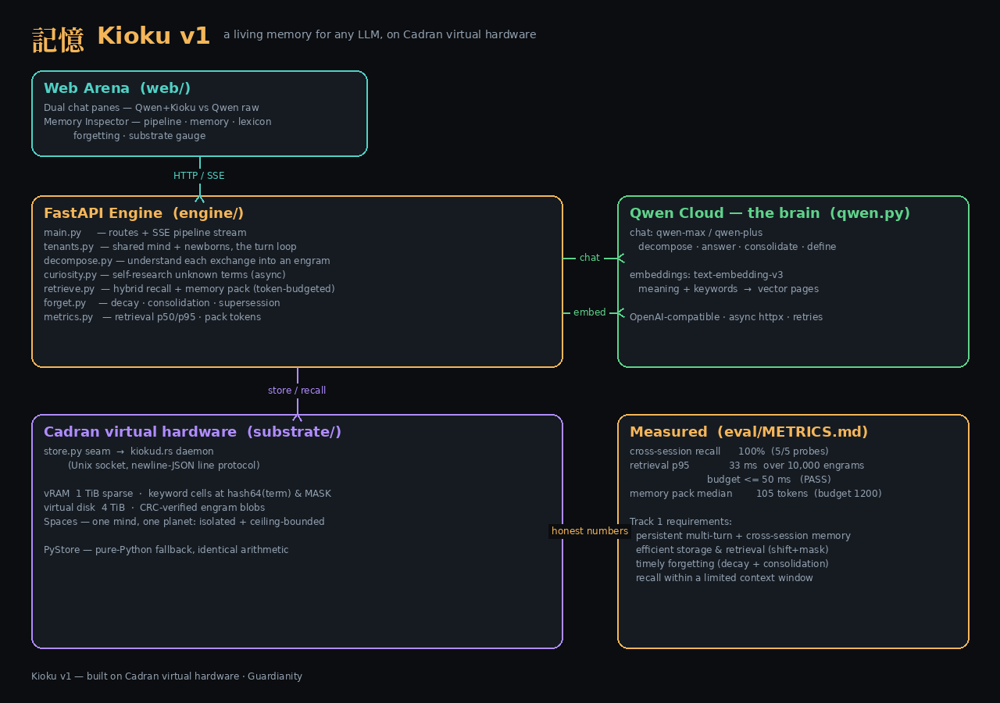

# Kioku 記憶 — a living memory for any LLM

[](LICENSE)
[](engine/tests)
[](substrate)

**Kioku doesn't store your messages — it _understands_ them.** Every exchange is
decomposed into meaning, intent, keywords, preferences and self-researched
definitions, then committed into a **Cadran virtual-hardware** substrate where
recall is a shift+mask jump. Same Qwen model, same key on both sides of the
arena — **only the memory differs.**

> Built for Track 1 (MemoryAgent), Global AI Hackathon with Qwen Cloud.
> The brain is **Qwen Cloud** (Alibaba Cloud Model Studio). License: Apache-2.0.



_30-second demo GIF: **TODO** — record per [docs/DEMO_SCRIPT.md](docs/DEMO_SCRIPT.md)._

## Quickstart

```bash
cp .env.example .env          # then set QWEN_API_KEY (Model Studio)
make demo                     # builds kiokud, serves arena + API at :8000
# open http://localhost:8000  → teach it, then hit "recall probe"
```

No Docker? `make demo` runs natively (Python venv + `rustc`). With Docker:
`docker compose up --build` (or `./deploy/alibaba/deploy.sh local`). If `rustc`
is missing, Kioku logs a fallback and runs on the pure-Python `PyStore` — the
demo still works; the Rust `kiokud` daemon is the headline.

```bash
make test    # Rust substrate tests + 100 Python tests
make eval    # fixtures → eval/METRICS.md (10k-engram latency, recall accuracy)
```

## Track 1 requirements → where in code

| Requirement | Where |
|---|---|
| Persistent memory, multi-turn **and** cross-session | [`engine/tenants.py`](engine/tenants.py) `KiokuEngine.turn`, [`engine/retrieve.py`](engine/retrieve.py) `MemoryIndex` |
| Efficient storage & retrieval | shift+mask keyword cells `hash64&MASK` + bounded vector window — [`engine/retrieve.py`](engine/retrieve.py), [`substrate/kiokud.rs`](substrate/kiokud.rs) |
| Timely **forgetting** of outdated info | decay · consolidation · contradiction supersession — [`engine/forget.py`](engine/forget.py) |
| Recall within a **limited context window** | token-budgeted memory pack (~105 tok median) — `MemoryIndex.build_pack` |
| Sophisticated Qwen use | decompose · curiosity · consolidate · embeddings · answer — [`engine/qwen.py`](engine/qwen.py), [`deploy/alibaba/PROOF.md`](deploy/alibaba/PROOF.md) |

## What's inside

- **`substrate/`** — Cadran virtual hardware (provided), plus `kiokud.rs`: a daemon
  owning one 1 TiB sparse vRAM box + 4 TiB virtual disk, served over a Unix-socket
  line protocol. `engine/store.py` is the client + a byte-compatible `PyStore`.
- **`engine/`** — FastAPI: `decompose`, `curiosity`, `retrieve`, `forget`,
  `tenants`, `metrics`, `qwen`. Async, typed, tested.
- **`web/`** — the dual-pane arena + memory inspector (vanilla, no build step).
- **`eval/`** — the harness and one honest committed run.
- **`deploy/alibaba/`** — Docker image, `deploy.sh`, `PROOF.md`, and a
  [hosting page](deploy/alibaba/index.html) for running on Alibaba Cloud ECS.

## Measured (not fabricated)

From a real `make eval` run on the `kiokud` backend — see [eval/METRICS.md](eval/METRICS.md):

- **100%** cross-session recall (5/5 probes)
- retrieval **p95 33 ms** over **10,000** engrams (budget ≤ 50 ms)
- memory pack **~105 tokens** median (budget 1200)

## Docs

[Architecture](docs/ARCHITECTURE.md) · [Memory model](docs/MEMORY_MODEL.md) ·
[Demo script](docs/DEMO_SCRIPT.md) · [Metrics](eval/METRICS.md) ·
[Alibaba Cloud deploy](deploy/alibaba/PROOF.md)

---

**Kioku v1** — built on Cadran virtual hardware · Guardianity
